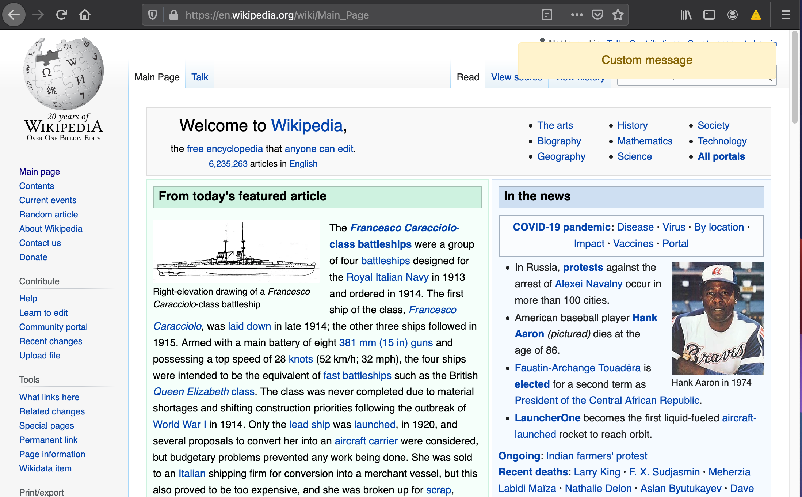
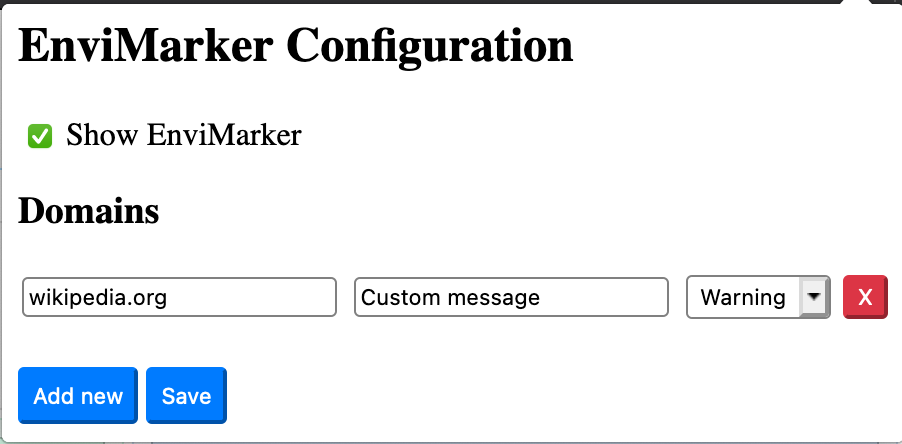

# Environment Marker

Simple browser extension for marking specific environment with a banner, to avoid accidentally doing things in production. By adding a domain (and optional message) from environment markers configuration, a warning banner will be shown on all sites of the domain. 

## Images

